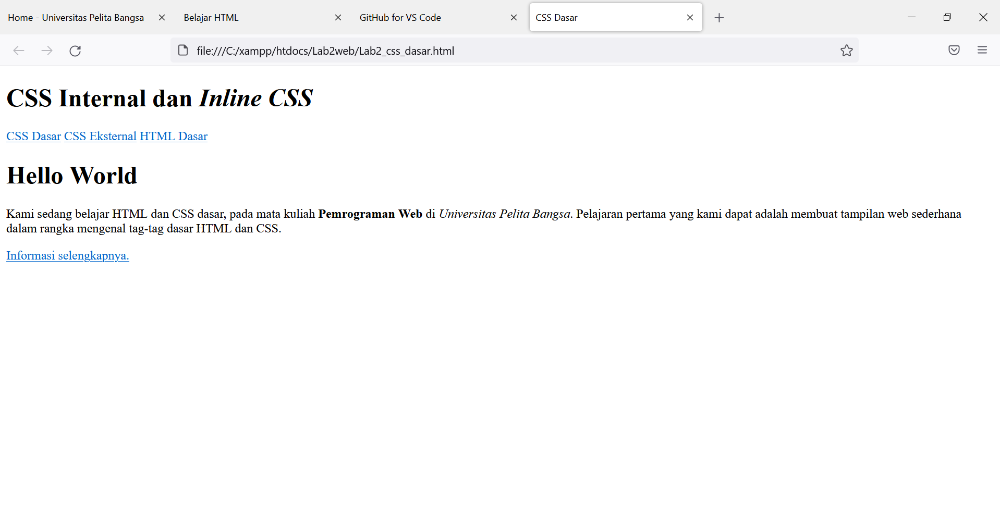
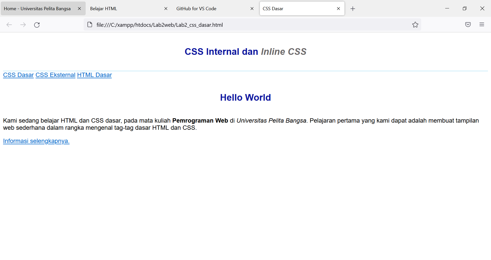
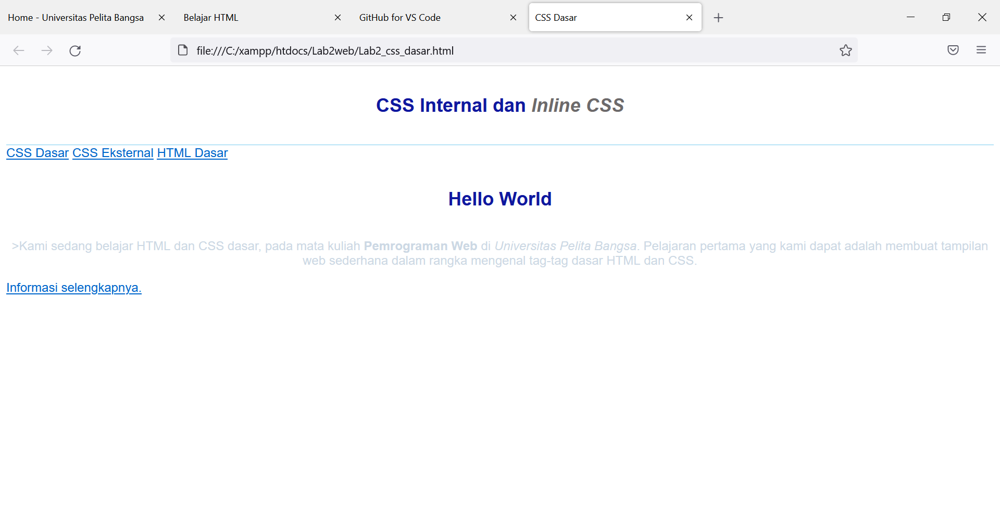
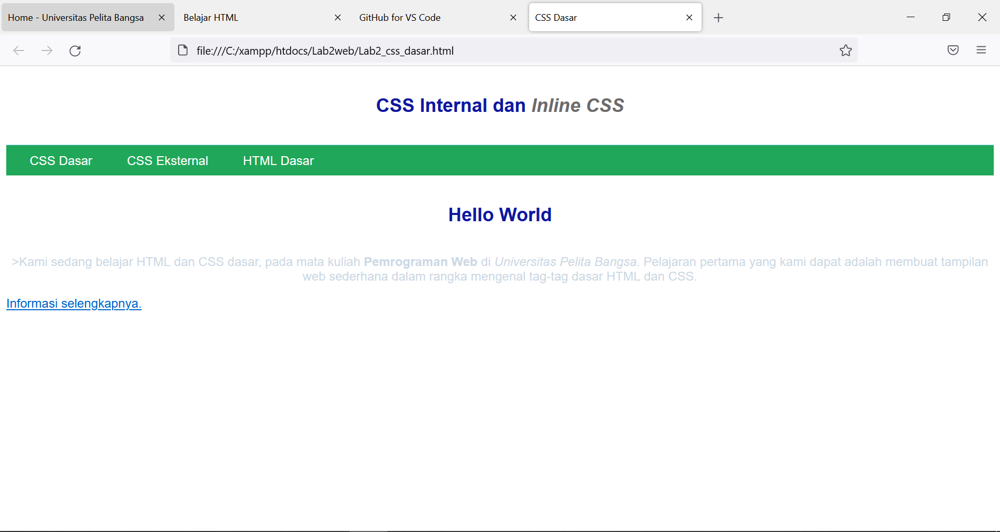
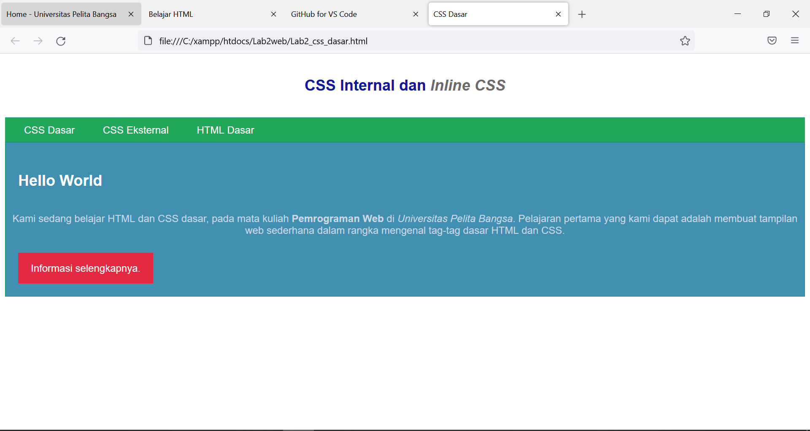
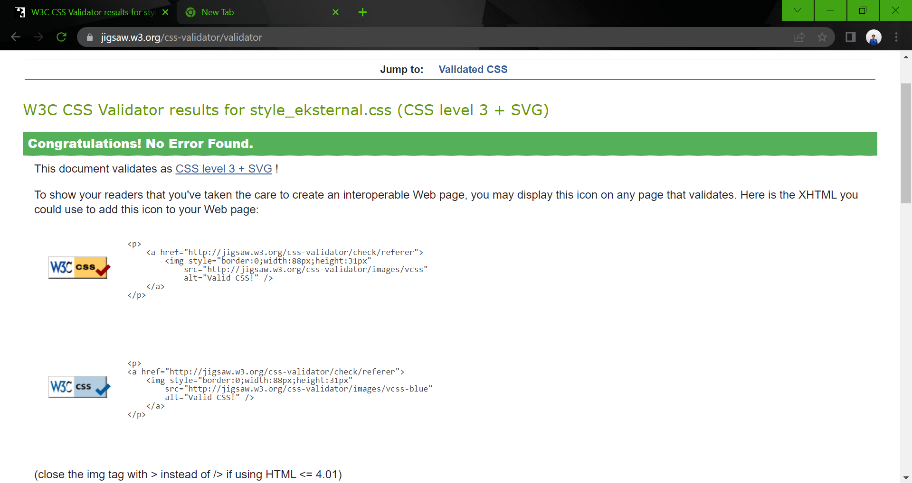

## Nama : Wayis Al Qorni TS
## Nim : 312010169
## Kelas : TI.20.A1
## Mata Kuliah : Web Pemrograman

### Pertemuan 3
## Lab2Web2

# 1 . Membuat Dokumen

Disini adalah file html yang belum terdapat file css nya , css internal dan css external serta inline

# 2.Membuat css internal

Css internal adalah css yang file nya terdapat pada dokumen html dengan pendeklarasian style css internal dapat digunakan hanya pada dalam dokumen saja

# 3. Membuat css inline

Css inline adalah css yang memiliki prioritas tertinggi dibanding internal dan eksternal

# 4. Membuat css eksternal

Css eksternal adalah css yang file nya terdapat sumber diluar html dengan melalui link akan terhubung dengan css

# 5. Menambahkan css slector

Css slector adalah css yang deklarasiannya dengan id dan class jika id dilambangkan dengan # Sedangkan class menggunakan .

# 6. validasi dokumen css

saya sudah memvalidasi file css dan tidak terjadi kesalahan